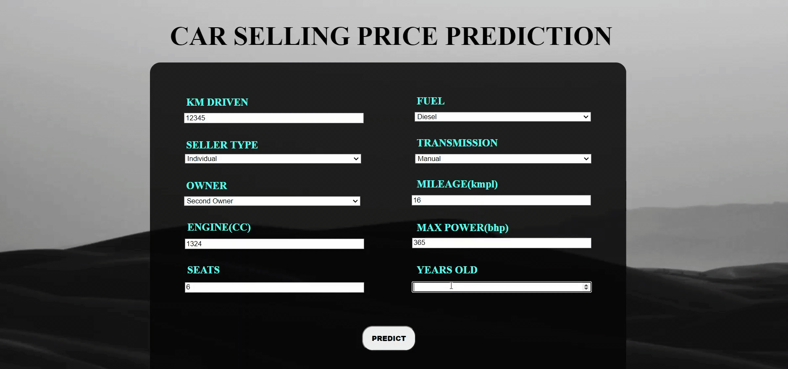

# Car Selling Price Prediction :blue_car:

A simple ML app to predict the prices of used cars.
It's build using traditional ML algorithm and deployed using Flask on Heroku.

## Demo
Link: [https://car-selling1price.herokuapp.com/](https://car-selling1price.herokuapp.com/)

<a href="https://car-selling1price.herokuapp.com/" align="center">
  
</a>

## :computer: Local Installation

1. Clone this Repo. </br> </br>
2. Create a virtual environment using [venv](https://docs.python.org/3/tutorial/venv.html) or [conda](https://docs.conda.io/projects/conda/en/latest/user-guide/tasks/manage-environments.html) to keep your project packages separately. </br> </br>
3. After navigating to the project base folder and activating the enviroment, run this command to install the required packages:

```bash
pip install -r requirements.txt
```
Now if you are using conda, you can directly create the env and install all packages using the file 'requirements.yml'. Just run:
```bash
conda env create -f requirements.yml
```

4. After installation, run 'app.py' which will use Flask's development server:
```bash
python app.py
```
## :open_file_folder: Directory Tree
```
.
├── app.py
├── data
│   ├── Car_details.csv
│   └── demo.gif
├── models
│   └── model.pkl
├── notebooks
│   └── Car_Selling_Price_Prediction.ipynb
├── preprocess.py
├── Procfile
├── README.md
├── requirements.txt
├── requirements.yml
├── static
│   └── index.css
├── templates
    ├── index.html
    └── output.html
    
5 directories, 13 files
```

## Deployment on Heroku

We will be using [gunicorn](https://gunicorn.org/) as our web server.

Create a Procfile, a text file in the root directory of application, to explicitly declare what command should be executed by heroku to start your app.
```bash
web: gunicorn <app_file_name>:app
```
Login or signup to [Heroku](https://www.heroku.com/home) in order to create virtual app. You can either connect your github profile or download Heroku CLI to manually deploy this project.

## Database
To store new data inputted by user, we have used a NoSQL MongoDB database and hosted it on MongoDB Atlas. This stored data can be further used for training a better model.

## 🏁 Technology Stack

* [scikit-learn](https://scikit-learn.org/)
* [Heroku](https://www.heroku.com/home)
* [Flask](https://flask.palletsprojects.com/en/2.0.x/)
* [gunicorn](https://gunicorn.org/)
* [MongoDB](https://www.mongodb.com/)


[](https://flask.palletsprojects.com/en/2.0.x/) [](https://gunicorn.org/)[](https://scikit-learn.org/)[](https://www.heroku.com/home)[](https://www.mongodb.com/atlas/database)
<br>
<h1 align = 'center'> THANK YOU!!!! :smiley:</h1>
